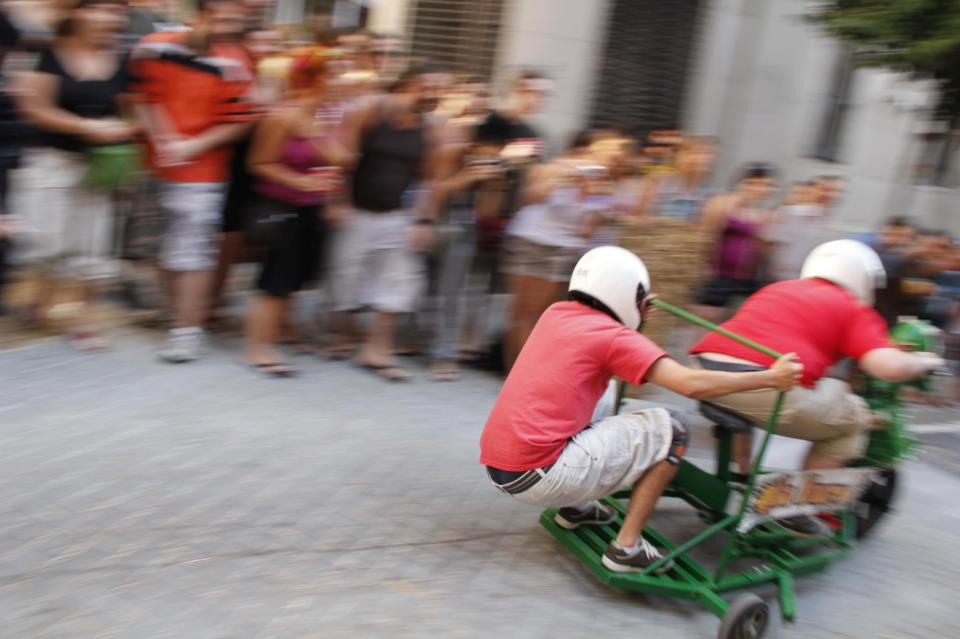

# Bernat

## Un Santsenc cicloactivista perdut per la Macarena
Enginyer informátic, pare y profesor.
Biciclista desde els 3 anys que vaig apendre a pedalejar. Carretonista desde 2002.
Sempre compromés amb el software llire, els drets humans i la llibertat d'expresió. 
Indignat per les injusticies d'aquest mon.

## Un Santsenc cicloactivista perdido por la Macarena.
Ingeniero Informático, padre y profesor.
Biciclista desde los 3 años que aprendí a pedalear. Y carrotentista desde 2020
Siempre comprometido con el Software libre, los derechos humanos y la libertad de expresión.
Indignado por las injusticias de este mundo.

